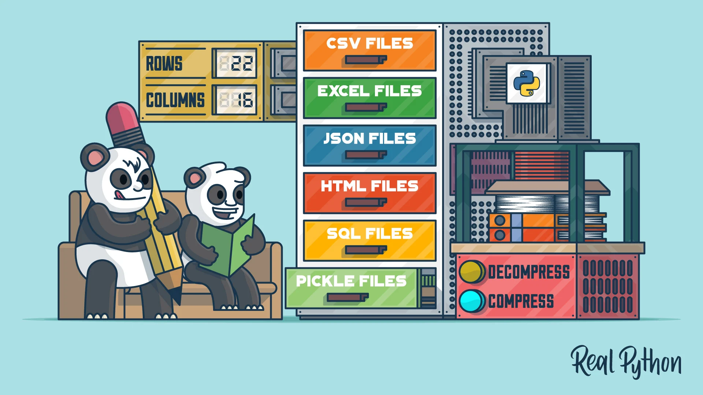

# Bienvenidos a mi proyecto de Analisis exploratorio de datos, utilizando la libreria Pandas 😃
# Pero antes...una foto con un poco de humor 📊😄

Mi repositorio incluye estás carpetas con estos archivos:

1. Archivos en bruto y resultado: Contiene los archivos con los que se empezó el proyecto, las instrucciones y el archivo resultante del analisis, llamado: clientes_merged_resultado

2. Apuntes y pasos seguidos: Contiene un archivo py con los apuntes del estudio a través de lo módulos (no relevante para el proyecto), y otro archivo py donde he ido aplicando las transofrmaciones, y realizado el análisis de datos

3. Archivos sueltos dentro del repositorio: el informe del análisis con las principales conclusiones, el archivo README y una foto.

Resumen del desarrollo del proyecto:

