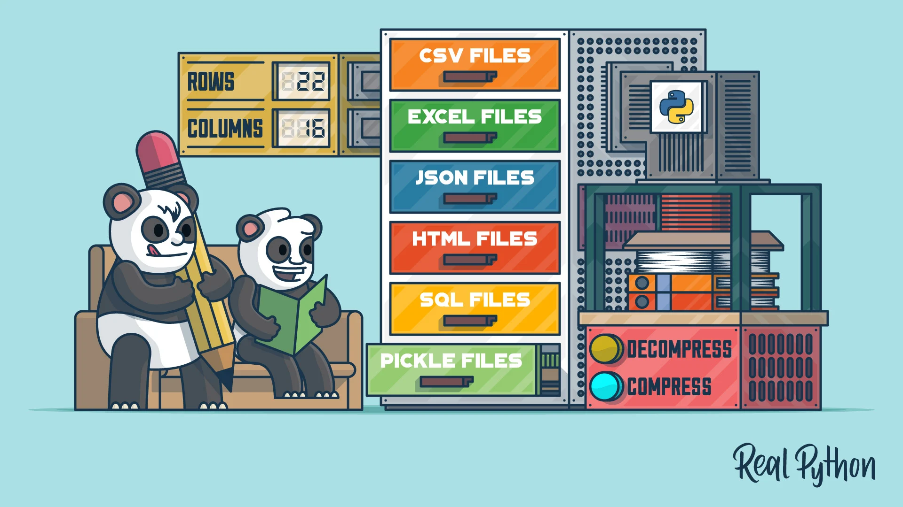

#  Limpieza y analisis de datos (EDA), utilizando la libreria Pandas 😃

2  3

Mi repositorio incluye estás carpetas con estos archivos:

1. Archivos en bruto y resultado: Contiene los archivos con los que se empezó el proyecto, las instrucciones y el archivo resultante del analisis, llamado: clientes_merged_resultado

2. Apuntes y pasos seguidos: Contiene un archivo py con los apuntes del estudio a través de lo módulos (no relevante para el proyecto), y otro archivo py donde he ido aplicando las transofrmaciones, y realizado el análisis de datos

3. Archivos sueltos dentro del repositorio: el informe del análisis con las principales conclusiones, el archivo README y una foto.

Resumen del desarrollo del proyecto:

Inicialmente, cargué ambos archivos. En uno de ellos se indicaba información de clientes, distribuidos por diferentes pestañas según el año en el que se unieron. En el otro, había una única pestaña con información adicional de esos clientes. Empecé a hacer el análisis del primer archivo, juntando todas las pestañas en una única a través del método “Concat”, para tener el año de unión de todos los clientes en un mismo archivo.
Después, empecé con la transformación del archivo poder analizarlo mejor, esto incluye limpieza de datos general para poder manejar y visualizar el archivo, y conocer los nulos que había, y el tipo de datos que presentaba cada columna. Después introduje nuevas columnas con el método “apply” que pudieran ayudar al análisis.

Después, me puse a hacer exactamente el mismo trabajo con el otro archivo, el que contenía información general de todos los clientes. Una vez ambos Data Frames estaban limpios, organizados y estructurados, los junté a través del método “Merge”, por la columna de ID de cliente, coincidente en ambos.

A continuación, comencé a hacer el análisis para sacar diferentes conclusiones del conjunto de datos. La manera en la que lo hice fue identificado variables especificas a través de las que pudieran sacarse conclusiones significativas. 

Al principio sentí que iba poco a poco, haciendo tablas sencillas a través de “Group by”. No obstante, a medida que iba avanzando en el proyecto, empecé a crear tablas a través de “pivot table”, juntar varios Data Frames surgidos a través de dos Group by, creación de columna adicionales derivadas de operaciones aritméticas, etc. 

Asimismo, en el aspecto de la visualización, he tratado de ser cuidadoso y preciso en la representación y creación de gráficas, siempre tratando de representar conclusiones significativas, y hacerlo a través de los gráficos más lógicos para la representación de cada conjunto de datos, combinando el uso de Matplotib y Seaborn.

En definitiva, considero que empecé poco a poco con análisis básicos, pero a medida que iba avanzando, conseguí hacer análisis y representaciones más significativas. Además, según avanzaba, se me iban ocurriendo nuevas variables en base a las que se podían analizar los datos, lo que considero que ha provocado un análisis más completo y organizado.

Muchas gracias por vuestro tiempo

Javier Bartolomé Jalvo
